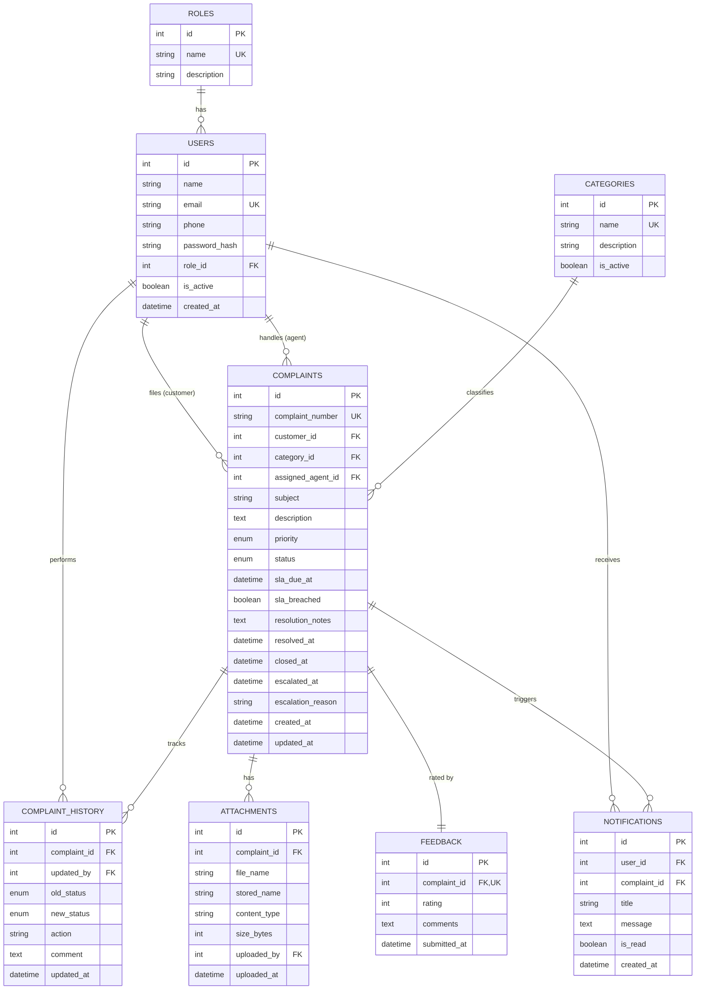
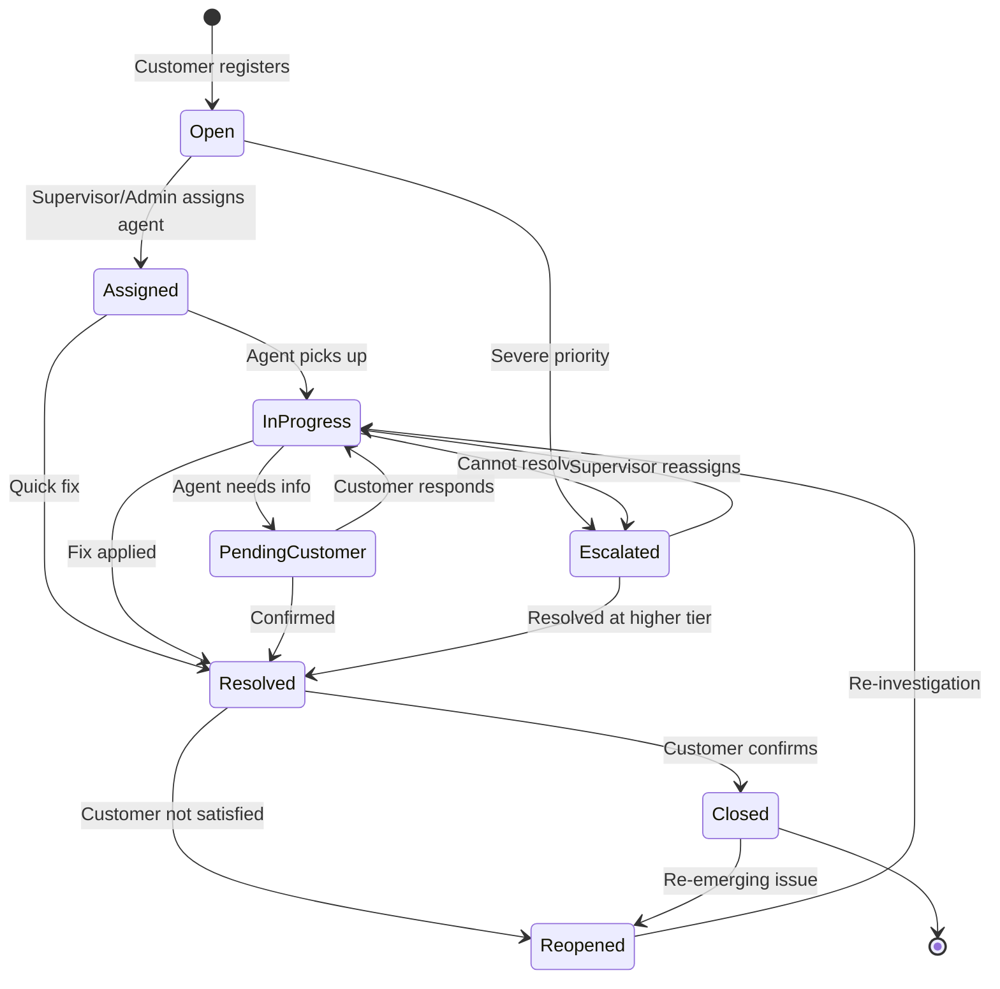

# Entity-Relationship Diagram

## Status Workflow

## SLA Rules

| Priority | Resolution Time |
|---|---|
| Low | 72 hours |
| Medium | 48 hours |
| High | 24 hours |
| Critical | 4 hours |

The `sla_due_at` column is computed at complaint creation as `created_at + SLA_HOURS[priority]`. The `sla_breached` flag is recomputed on every read so dashboards reflect the latest state without a background job.
